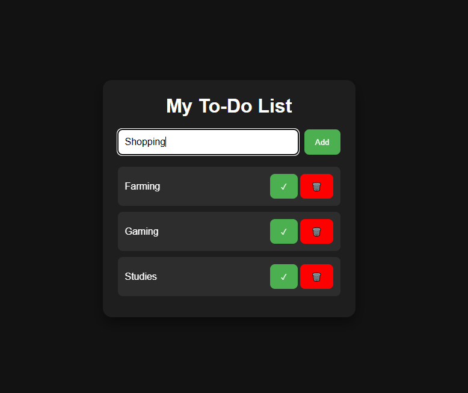

# To-Do List App

A responsive To-Do List built with HTML, CSS, and JavaScript.

## Features

- Add tasks
- Delete tasks
- Mark tasks as completed
- Save tasks using Local Storage
- Responsive design

## Technologies

- HTML5
- CSS3
- JavaScript

## Screeenshot

## Future Improvements

- Edit existing tasks
- Add due dates
- Task categories
- Dark/Light mode

## Author

Ohene Richmond Kwasi
GitHub: Zytrix-Tech05